# To do list manager (TDLM)
            TDLM é um sistema in line para controle de tarefas, ou seja, utilizando 
        comandos do terminal realizamos ações na nossa lista de tarefas armazenas em um JSON.

---
### Código
Funções para facilitar algumas exibições ao usuário: 

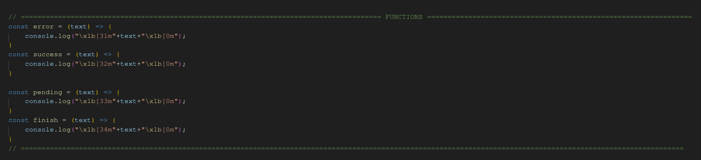

Ler e validar a existência do nosso arquivo usado para salvar os dados e da nossa lista: 

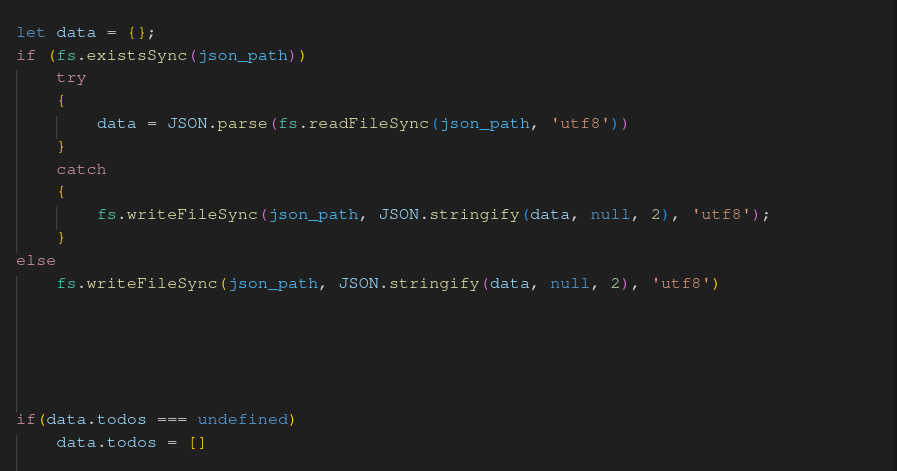

Pegar o comando e os argumentos passados: 

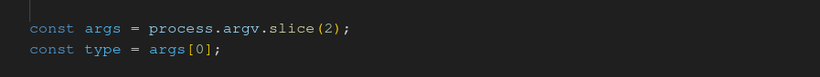

Switch case para podermos atribuir um comportamento diferente para cada comando passado: 

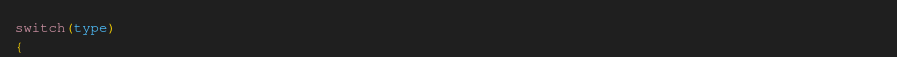

Funcionamento do 'add': 

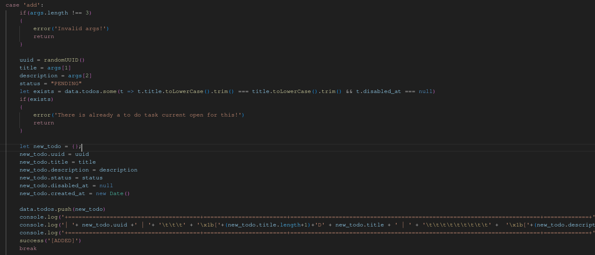

Funcionamento do 'remove': 

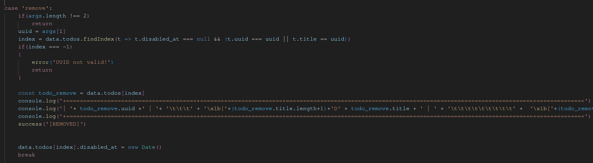

Funcionamento do 'finish': 

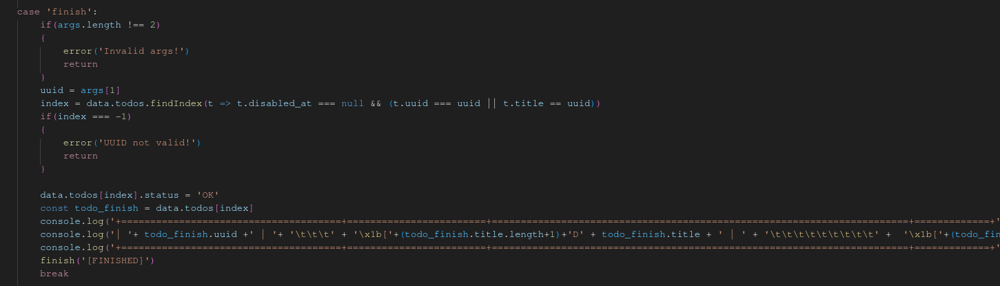

Funcionamento do 'pending': 

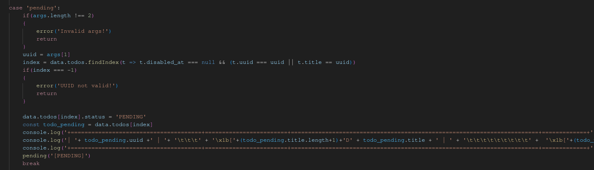

Funcionamento do 'list': 

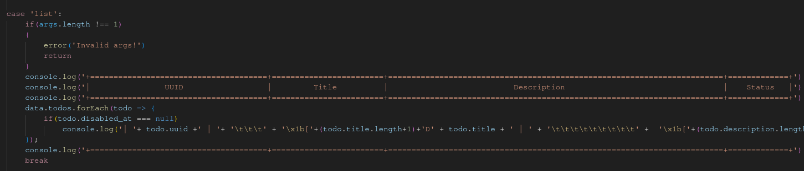

Funcionamento do 'listpending': 

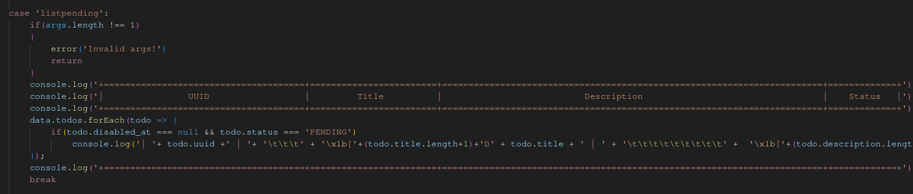

Funcionamento do 'listfinished': 

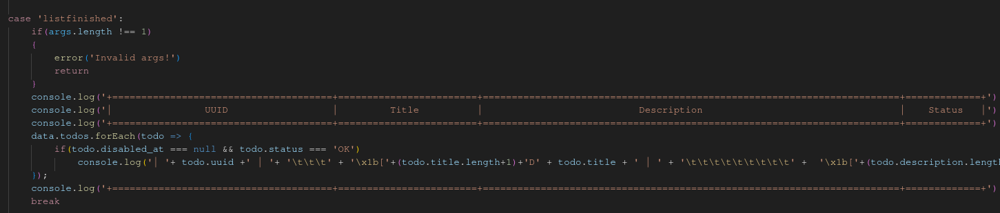

Caso insira um comando inválido: 

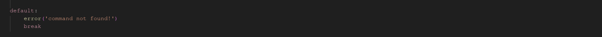

Salva o valor no json: 

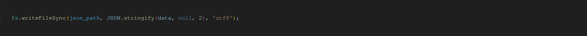

---
        
### Comandos
Adicionar uma nova tarefa:
> **node ./tdlm.js**  add  [TITULO] [DESCRICAO]

Remover uma tarefa indesejada ou incorreta
> **node ./tdlm.js**  remove [TITULO] | [UUID]

Listar todas as tarefas
> **node ./tdlm.js**  list

Definir uma tarefa como finalizada
> **node ./tdlm.js** finish [UUID] | [TITLE]

Definir uma tarefa como pendente
> **node ./tdlm.js** pending [UUID] | [TITLE]

Listar as tarefas finalizadas
> **node ./tdlm.js**  listfinished

Listar as tarefas pendentes
> **node ./tdlm.js**  listpending

Feito por: [@ClCaldd](https://github.com/ClCaldd)
